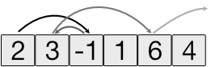

A repository of coding challenges/tasks I came across in various job interviews.
I mostly do backend programming in Go and PHP, so here you can find some solutions.

The solutions to the tasks do not fulfill to be the shortest, fastest or cleanest solutions.

## Tasks

Each task should come with a solution plus some tests to verify.

### Task 1

Create a function `maskify` to mask digits of a credit card number with `#`.

**Requirements:**

- Do not mask the first digit and the last four digits
- Do not mask non-digit chars
- Do not mask if the input is less than 6
- Return '' when input is empty

### Task 2

Create a function `number_to_ordinal` to create an ordinal number for a given input.
Ordinal numbers in English have something like `st`, `nd`, `rd`, etc.

**Requirements:**

- Apply for number 1 to 1001... if that works any given number will do ;-)

### Task 3

Create a calculator for [Reverse Polish Notation](https://en.wikipedia.org/wiki/Reverse_Polish_notation).
Write a `calculate` function that accepts an input and returns the result of the operation.

**Requirements:**

- Support the mathematical operations for `+`, `-`, `*` and `/`
- Check for invalid syntax, like `2 3+`. There is a space missing.
- Return 0 (integer) when nothing is entered
- Return the numeric value when no operand is given, like `1 2 3.5` return `3.5`

### Task 4

Given you have an array of numbers, you move inside the array by the value of the current element.
Write a function `jump_out_of_array` that outputs

- the amount of jumps until you jump out of the array
- `-1` when you reach the end of the array but do not jump out

** Requirements:**

- Array size is indefinite
- Array elements are integers, positive and negative

**Example:**

Given an array of `A[2, 3, -1, 1, 6, 4]`.

- Jump 1: A[0] + 2 = A[2]
- Jump 2: A[2] + (-1) = A[1]
- Jump 3: A[1] + 3 = A[4]
- Jump 4: A[4] + 6 = out of range

So the result is `4`, you need 4 jumps to jump out of the array.

## Contribute

Feel free to contribute. Use the issue list to propose new tasks or open PRs. Just provide proper tests
and description and requirements for the tasks.
